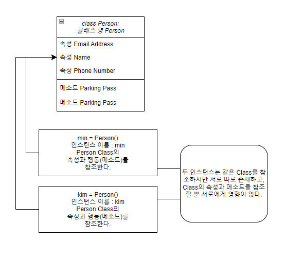

# 객체지향 프로그래밍

### - 클래스(Class) : 같은 종류의 집단에 속하는 속성(attribute)과 행위(method)를 정의한것 
### - 인스턴스(instance) : 클래스를 실제로 메모리상에 할당한 것
### - 속성(attribute) : 클래스/인스턴스가 가지고 있는 데이터/값
### - 행위(method) : 클래스/인스턴스가 가지고 있는 함수/기능

### > 클래스를 선언한다(붕어빵 틀을 만든다) -> 인스턴스를 생성한다(붕어빵을 찍어낸다) <br>
### > 클래스엔 속성과 행위가 포함되어있으며, 생성한 인스턴스는 이 내용을 참조한다.


- 클래스를 선언 (붕어빵 틀 만들기)
    - `class 클래스명:`
    - `속성`
    - `행위`
```python
class TestClass:
    a = 1
    
    def b(self):
        print('b')
```

- 인스턴스 생성 (붕어빵 찍어내기)
    - 클래스의 속성과 메소드를 참조한다
    - 속성을 출력하거나 메소드를 실행할 수 있다
```python
class_a = TestClass()
# 인스턴스에서 클래스를 참조한 a 라는 속성 값을 출력
print(class_a.a)
# 인스턴스에서 메소드를 바로 실행 가능 
class_a.b()
```    

## 클래스 연습

```python
# 클래스 MyList 선언
class MyList:
    # 비어있는 리스트 형태의 속성 data
    data = []
    # append 라는 이름의 함수 정의 (메소드)
    # 여기서 인자에 self가 있는 것은 인스턴스 자신 이라는 뜻으로
    # 이 Class를 참조해 생성한 인스턴스 자신을 뜻하는 것이다
    def append(self, item):
        self.data += [item]
    # data안에 맨 마지막 요소를 삭제하고 삭제된 요소 하나 리턴
    def pop(self):
        num = self.data[-1]
        self.data = self.data[:-1]
        return num
```
```python
# 인스턴스 생성
list_a = MyList()
# append 메소드 실행
list_a.append(123) 
# pop 메소드 실행
list_a.pop()
```

```python
# 정리
class Person:   # => 클래스 정의(선언) : 클래스 객체 생성
    name = 'hong'   # => 속성(attribute) : 변수/값/데이터

    def hello(self):       # => 행동(method) : 함수/기능
        return self.name

p = Person()   # => 인스터스화 했다. 인스턴스 객체를 생성했다.
p.name # => 속성을 호출
p.hello() # => 메소드 호출
```


- 생성자, 소멸자

- def __init__(self):
    - 생성될 때 호출되는 메서드

- def __del__(self):
    - 소멸될 때 호출되는 메서드
```python
class Person():
    name = ''

    def __init__(self, name='이름없음'):
        self.name = name
        print('생성됨')

    # def __del__(self):
    #     print('소멸됨')
```

- 클래스변수
    - 클래스 선언 블록 최상단에 위치
    - ClassName.class_variable 로 접근 / 할당

- 인스턴스 변수
    - self.instance_variable 로 접근 / 할당

```python
t1 = TestClass('인스턴스변수')
# 클래스 변수 확인
print(TestClass.class_variable)
print(t1.class_variable)
# 인스턴스 변수 확인
print(t1.instance_variable)
```
- 클래스 선언시 여러 메소드들
```python
class MyClass:
    # instance method
    def instanc_method(self):
        return self

    # class method
    @classmethod
    def class_method(cls):
        return cls

    # static method
    @staticmethod
    def static_method(arg):
        return arg
```
- 상속
    - 상위 클래스의 기능을 상속받는다는 의미로 () 안에 클래스명을 작성
```python
class Student(Person):
    def __init__(self, name, id):
        self.name = name
        self.id = id
        Person.population += 1
```

- 메소드 오버라이딩
    - 상속받아 만드는 클래스에서 같은 이름의 함수를 덮어씌워서 작성하는 것
```python
class Soldier(Person):
    # method overriding 메소드 오버라이딩
    def greeting(self):
        print('충성!!!')

# s2 = Soldier('국방이')
# s2.greeting()
```


- 다중상속
    - 상속의 순서에 따라 같은 속성에 대해서 먼저 작성된 클래스를 우선적으로 선택하는 특징이 있음.
```python 
class Person():
    def __init__(self, name):
        self.name = name

    def breath(self):
        print('후하')


class Mom(Person):
    gene = 'XX'

    def swim(self):
        print('어푸어푸')

    def greeting(self):
        print('안녀어어어영')

class Dad(Person):
    gene = 'XY'

    def run(self):
        print('다다다')       

    def greeting(self):
        print('안녕!')     

# 상속된 순서에 따라 같은 속성, 데이터, 메소드를 가졌을 때 먼저 작성된 클래스를 우선적으로 저장한다.
class FirstBaby(Mom, Dad):
    pass
b1 = FirstBaby('첫째')
# b1.swim()
# b1.run()
# b1.greeting()
# print(b1.gene)

class SecondBaby(Dad, Mom):
    pass
b2 = SecondBaby('둘째')
# b2.breath()
# b2.run()
# b2.greeting()
# print(b2.gene)        
```